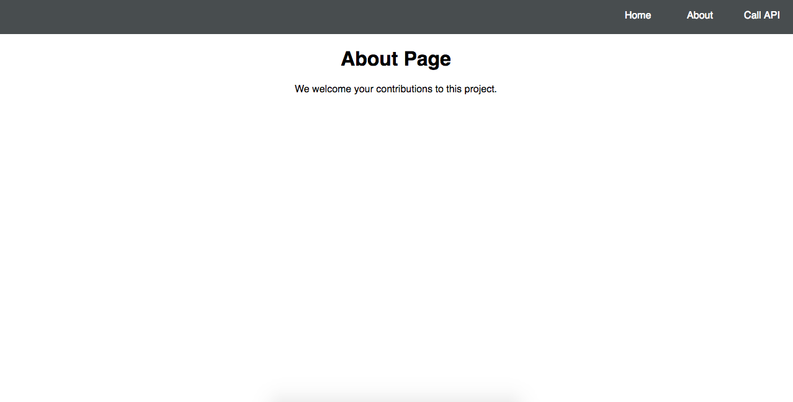
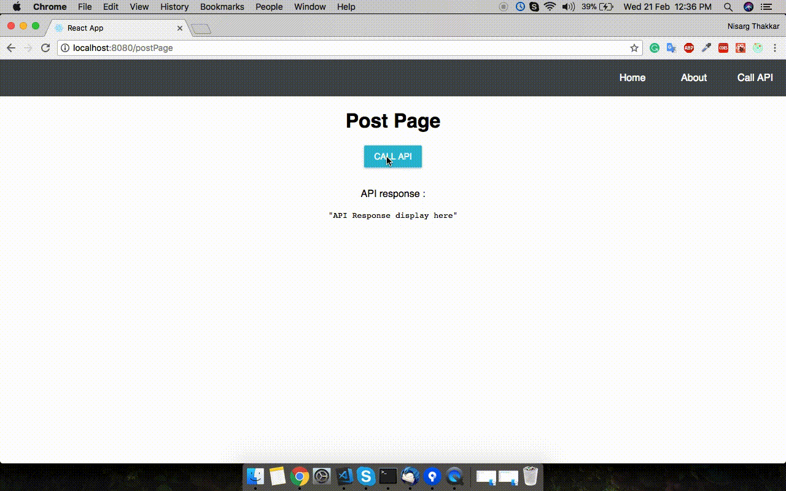

# React + Redux + Webapck + Eslint Starter Project


- [x] [React](https://facebook.github.io/react/) — A virtual DOM JavaScript library for rendering UI.
- [x] [Redux](http://redux.js.org/) — An incredibly simple way of modelling your data app state.
- [x] [Webpack](https://webpack.js.org/) — Client-side module builder and module loader
- [x] [material-ui](http://www.material-ui.com/) - React components that implement Google's Material Design
- [x] [React Router Redux](https://github.com/reactjs/react-router-redux) — Simple bindings to keep React Router and Redux in sync
- [x] [Yarn](https://yarnpkg.com/) — Package manager and task runner
- [x] [Babel](http://babeljs.io/) — Transpiler from ES6 / JSX to ES5
- [x] [ESLint](http://eslint.org/) — As a reporter for syntax and style issues

## Getting Started

### Installation

```
git clone https://github.com/nisargrthakkar/react-redux-starter-kit.git
cd react-redux-starter-kit
yarn install
```

### Development

Build for Development:

```$ yarn build:dev```

Start Server for Development:

```$ yarn server:dev```

Build for Production:

```$ yarn build:prod```

Start Server for Production:

```$ yarn server:prod```


Hot reloading via webpack middlewares:

```$ yarn start```

Point your browser to http://localhost:8080/, page hot reloads automatically when there are changes


Check eslint errors 

```$ yarn eslint```


## Debugging

For debugging purposes please use:
- [Redux DevTools
](https://chrome.google.com/webstore/detail/redux-devtools/lmhkpmbekcpmknklioeibfkpmmfibljd) plugin for Chrome to simplify debugging React apps.
- [React Developer Tools](https://chrome.google.com/webstore/detail/react-developer-tools/fmkadmapgofadopljbjfkapdkoienihi)


## How do I deploy this?

`yarn build`. This will prepare and build the project for production use.

- Places the resulting built project files into `/dist` directory. (This is the folder you'll put on server).

- Start Server for Production: ```$ yarn server:prod```


## How to keep your project updated

If your application is a fork from this repo, you can add this repo to another git remote:

```
git remote add upstream https://github.com/nisargrthakkar/react-redux-starter-kit.git
```
Then, use git to merge some latest commits:

```
git pull upstream master
```


## How to Contribute

We welcome your contributions to this project. There are various ways to contribute:

**Reporting issues**

Help improve the project by reporting issues that you find by filing a new issue at the
[react-redux-starter-kit issue tracker](https://github.com/nisargrthakkar/react-redux-starter-kit/issues/new).

**Features suggestions**

You can also add feature suggestions by filing a new issue at the
[react-redux-starter-kit issue tracker](https://github.com/nisargrthakkar/react-redux-starter-kit/issues/new).

**Documentation**

You can help by adding or improving existing documentation. Simply send us a pull request for us to
consider your proposed changes.

**Bug fixes**

Pull requests are welcome for minor bug fixes or enhancement of this kit.

## Some Screen Shot of Starter Kit

#### Home Screen

#### About Screen

#### Call API Screen


## License

[MIT License](https://nisargrthakkar.mit-license.org/), 2018  by Nisarg R. Thakkar

